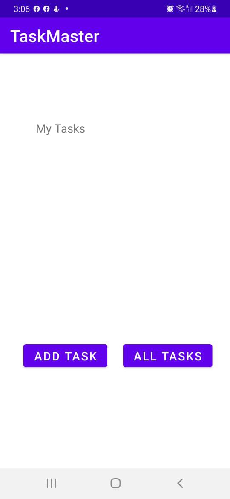
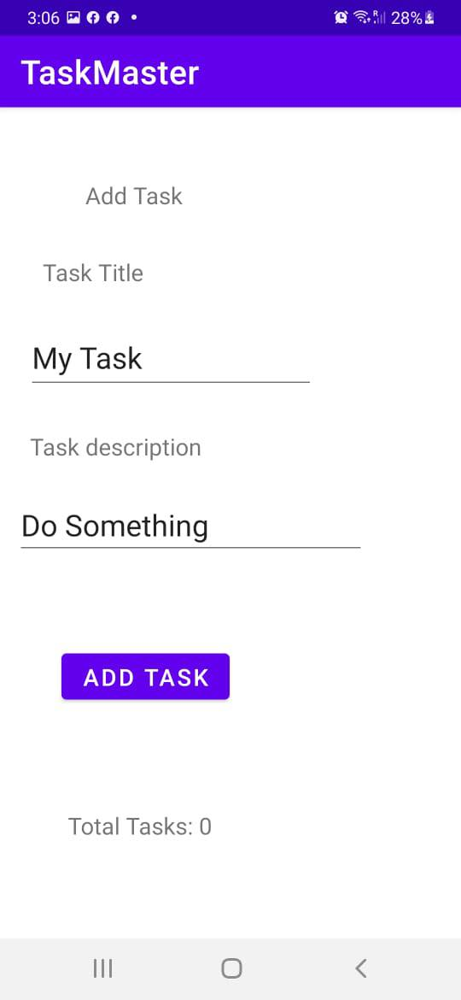
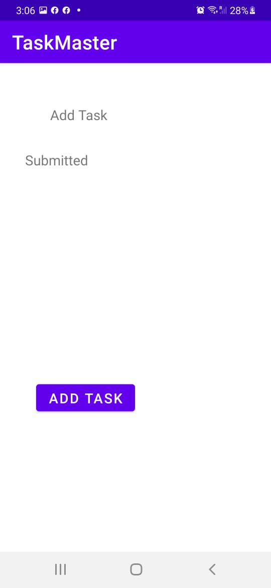
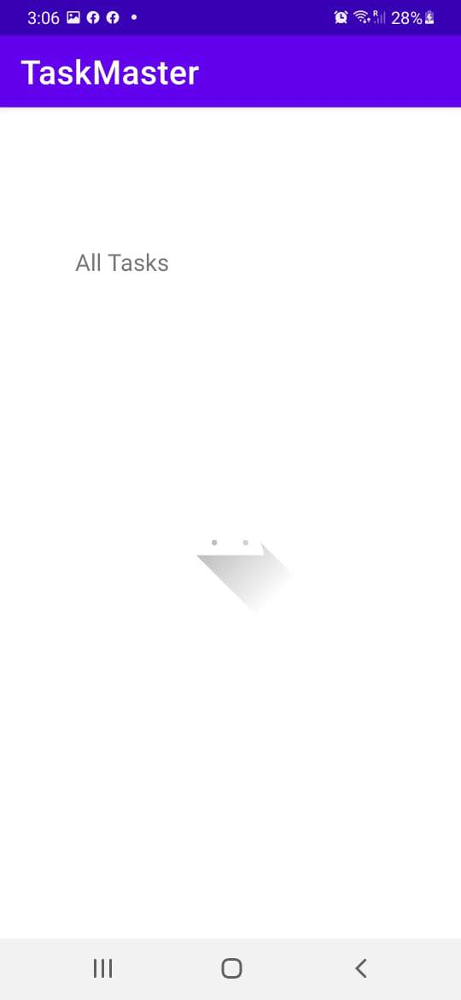
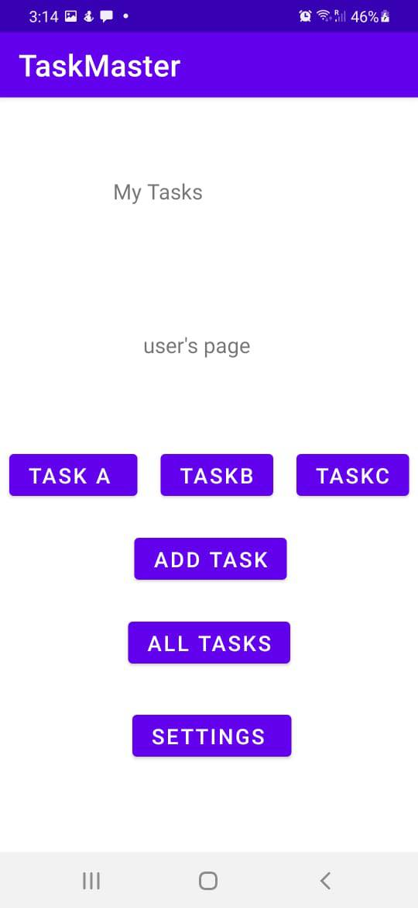
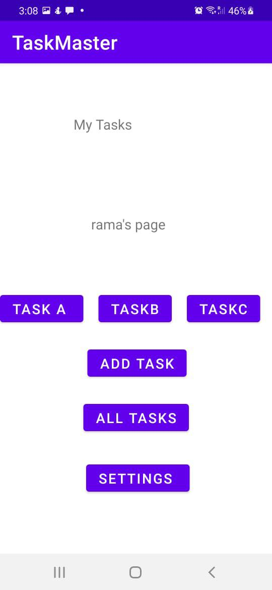
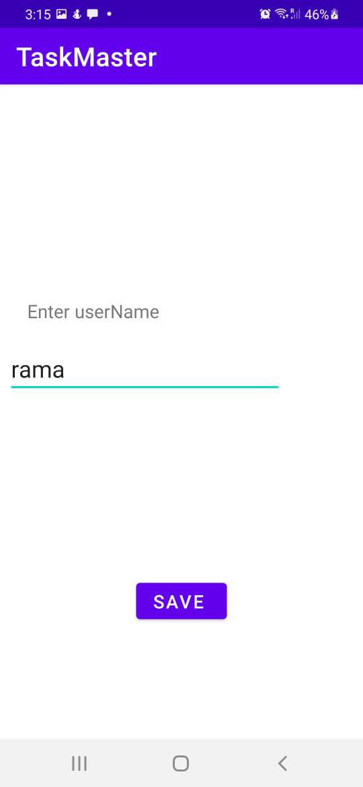
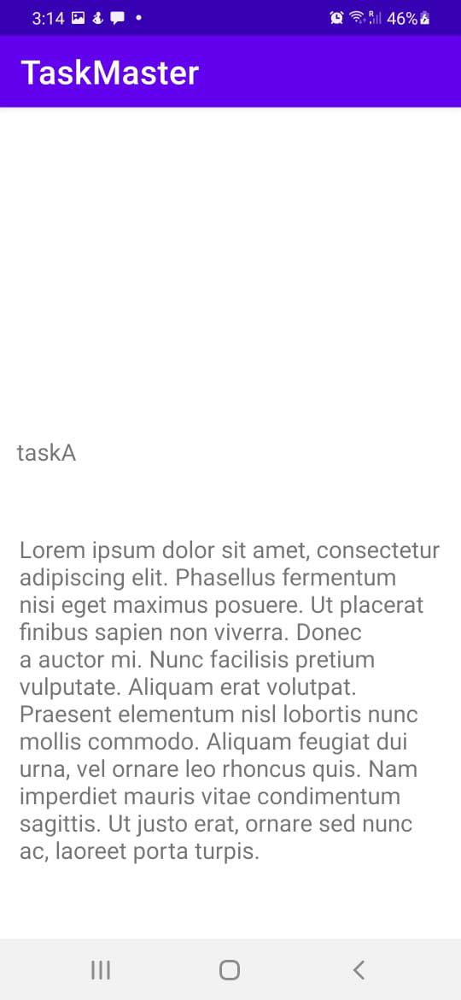
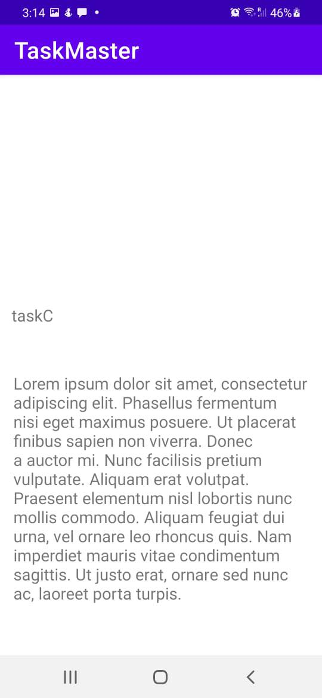
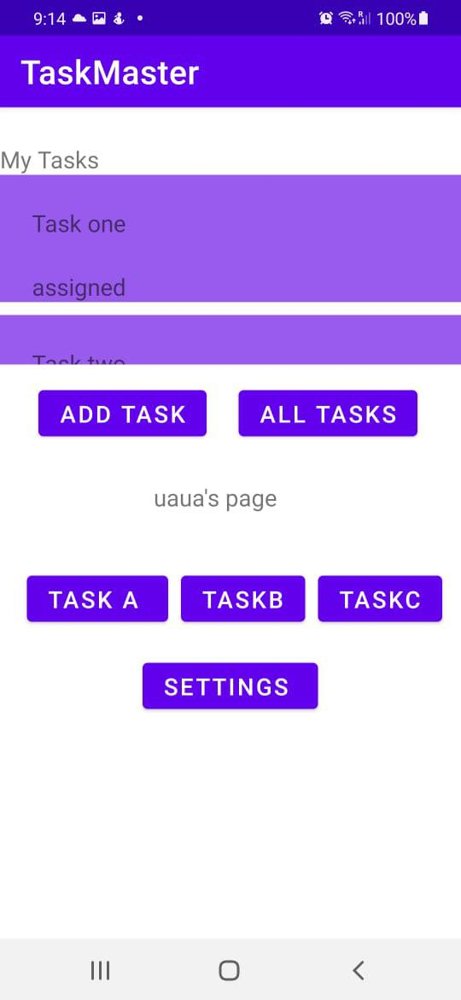

# taskmaster

this page gives the user the option to add tasks or see all tasks. 

the user is allowed to add a task and to specify a title and a description for it, the user is able to keep track on the number of tasks you added 

once you have added a task you will see a submitted label to indicate the your task is submitted successfully

a page where the user is able to see all the tasks you have 

_____________________________

># challenge-27 

in this modified homepage the user has three tasks added
 - TaskA
 - TaskB
 - TaskC 

 where the user can click on them and see their details 

 it also has a new button that takes the user to the settings page where the user can enter his username. 

 
the homepage with the user's username. 

 
the settings page where the user is able to set his user name and save it. 

the details page for task A 

the details page for task B 

the details page for task C  

> lab-28 

 
 the main page now has a recycler view list 
 that holds tasks each has a title and a state, once you click on a state you will be directed to the detail page for this task 

