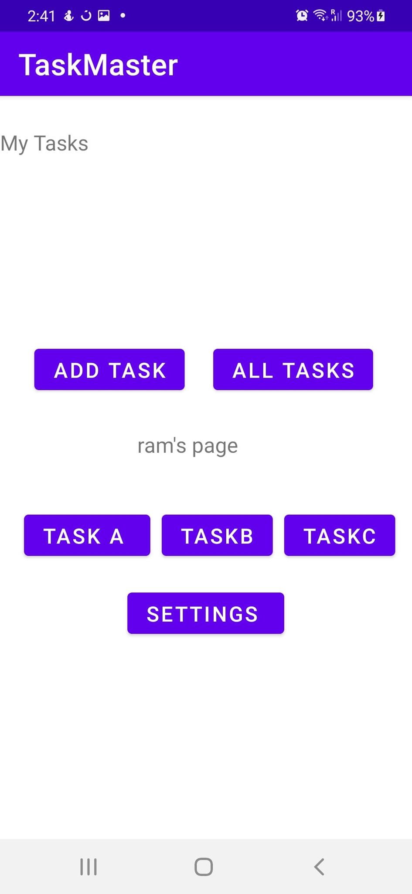
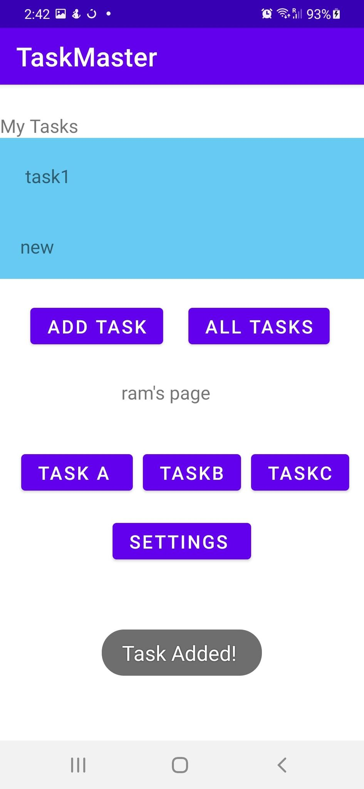
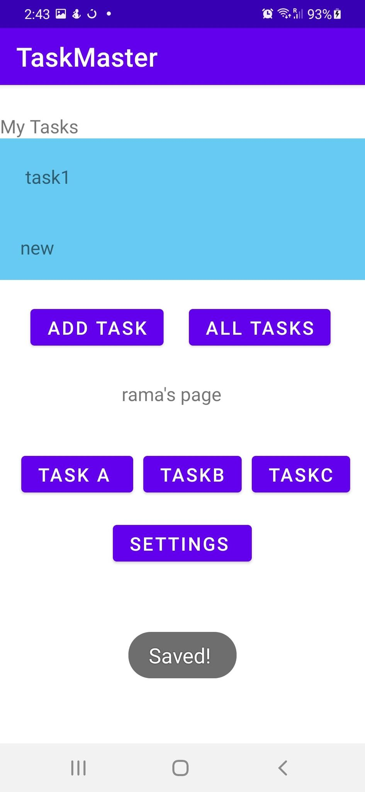
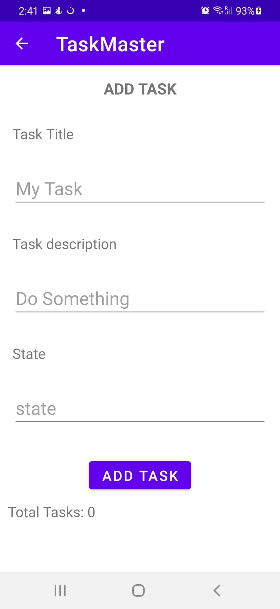
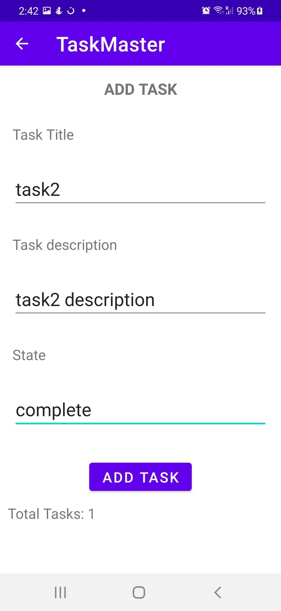
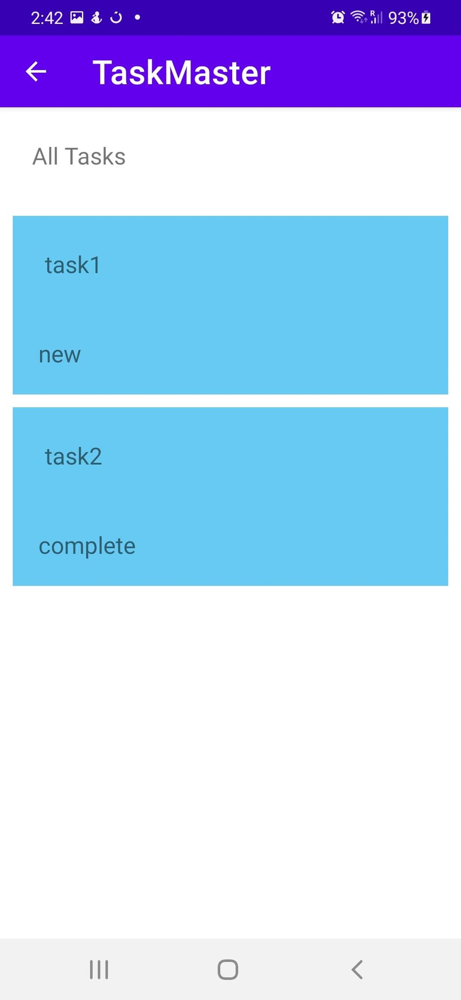
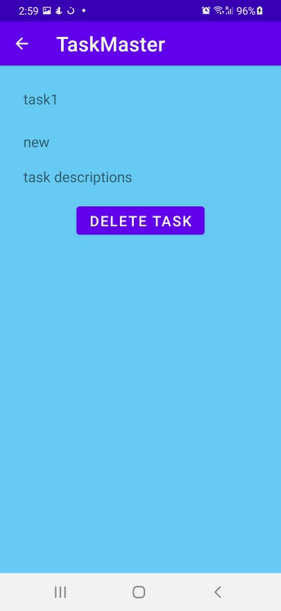

# taskmaster

this page gives the user the option to add tasks or see all tasks. 

the user is allowed to add a task and to specify a title and a description for it, the user is able to keep track on the number of tasks you added 

once you have added a task you will see a submitted label to indicate the your task is submitted successfully

a page where the user is able to see all the tasks you have 

_____________________________

># challenge-27 

in this modified homepage the user has three tasks added
 - TaskA
 - TaskB
 - TaskC 

 where the user can click on them and see their details 

 it also has a new button that takes the user to the settings page where the user can enter his username. 

 
the homepage with the user's username. 

 
the settings page where the user is able to set his user name and save it. 

the details page for task A 

the details page for task B 

the details page for task C  

> lab-28 

 
 the main page now has a recycler view list 
 that holds tasks each has a title and a state, once you click on a state you will be directed to the detail page for this task 

 > # lab-29 

 the home page when there are no tasks added 

the home page when there are is only one tasks added

the home page when the user sets the username and saves it 

 the addTaskPage when you don't have any tasks yet 
 you can see the task count equals 0 

 

when you add another task you can see that the number for the task count is changed 

here you will see all the tasks you have 

here is the details page where you can delete the task that you don't want anymore 

> # lab-31 Espresso tests 

test were added to this application
- testing for important UI elements, if they are displayed on the page.

-  test taping on a task, and assert that the resulting activity displays the name of that task
this was implemented on the recycler view - the first task 

-  test the edit of the user’s username, and assert that it says the correct thing on the homepage

